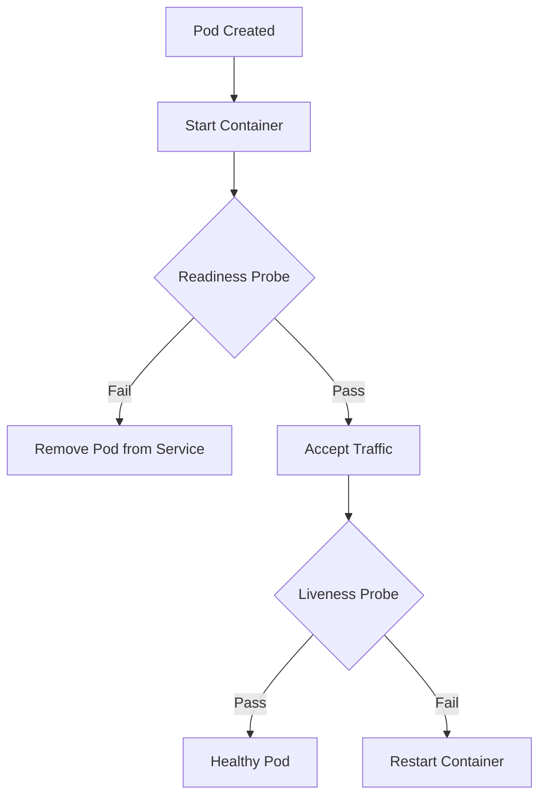

# Kubernetes Readiness and Liveness Probes

In Kubernetes, **probes** are used to determine the health and availability of a container inside a Pod. There are two main types:

---

## ✅ 1. Readiness Probe

### ✅ Purpose:

To check **if the container is ready to accept traffic**.

### ✨ Use Case:

Used by **Kubernetes Services** to decide **whether to send traffic** to a pod or not.

### 🔍 Example Scenario:

Your app takes 30 seconds to initialize. During this time, we don't want traffic hitting the container until it is ready.

### 🔹 YAML Example:

```yaml
readinessProbe:
  httpGet:
    path: /health
    port: 8080
  initialDelaySeconds: 10
  periodSeconds: 5
```

### 💡 Key Fields:

* `initialDelaySeconds`: Wait time before the first check
* `periodSeconds`: How often to check readiness

---

## ❌ 2. Liveness Probe

### ✅ Purpose:

To check **if the container is alive and running**. If it fails, Kubernetes **restarts the container**.

### ✨ Use Case:

Used to detect **stuck or dead** containers. Helps with self-healing.

### 🔍 Example Scenario:

Your container runs into a deadlock but doesn't crash. Kubernetes won't know until a **liveness probe** fails and restarts it.

### 🔹 YAML Example:

```yaml
livenessProbe:
  httpGet:
    path: /healthz
    port: 8080
  initialDelaySeconds: 15
  periodSeconds: 10
```

### 💡 Key Fields:

* `failureThreshold`: How many failures before restart
* `timeoutSeconds`: Max time to wait for response

---

## ❓ Common Doubts

### 1. Can I use both probes together?

Yes. Very common. `readiness` controls traffic. `liveness` controls restarts.

### 2. Will the pod be restarted on readiness probe failure?

❌ No. It will be **removed from service endpoints**, not restarted.

### 3. What probe types are available?

* `httpGet` — hits an endpoint
* `tcpSocket` — opens a TCP connection
* `exec` — runs a command inside container

---

## 👩‍💻 DevOps Engineer Notes

* Always use probes in production
* Helps rolling updates to be smooth
* Monitor probe failure metrics in Prometheus

---

## 📊 Anatomy of Probes in Pod YAML

```yaml
spec:
  containers:
  - name: my-app
    image: myapp:v1
    readinessProbe:
      httpGet:
        path: /health
        port: 8080
      initialDelaySeconds: 5
      periodSeconds: 5
    livenessProbe:
      httpGet:
        path: /healthz
        port: 8080
      initialDelaySeconds: 15
      periodSeconds: 10
```

---

## ✨ Real-World Example:

You deploy a Node.js app that needs DB connection before it's ready. Use **readinessProbe** to delay traffic. If the app hangs due to memory leak, **livenessProbe** will detect and restart.

---

This completes the concept of **Readiness vs Liveness Probes**. Next topic: `ServiceAccounts + RoleBinding for pod permissions`. Let me know when to proceed 🚀

## Kubernetes: Readiness vs Liveness Probes

### 📌 Overview

In Kubernetes, **Readiness** and **Liveness** Probes are used to monitor the health of a pod and decide whether it should receive traffic or be restarted.

---

### 🔍 What is a Liveness Probe?

A **Liveness Probe** checks if the application inside the pod is still running. If the liveness probe fails, Kubernetes **restarts the container**.

#### 💡 Use Case:

* App stuck in a deadlock or infinite loop.
* Container is running but not responding to requests.

#### ✅ Example YAML:

```yaml
livenessProbe:
  httpGet:
    path: /healthz
    port: 8080
  initialDelaySeconds: 5
  periodSeconds: 10
```

---

### 🔍 What is a Readiness Probe?

A **Readiness Probe** checks if the application is ready to serve traffic. If it fails, Kubernetes **removes the pod from the service endpoints**, but doesn't restart it.

#### 💡 Use Case:

* App takes time to load or initialize.
* Temporarily unhealthy but doesn’t need restart.

#### ✅ Example YAML:

```yaml
readinessProbe:
  httpGet:
    path: /ready
    port: 8080
  initialDelaySeconds: 5
  periodSeconds: 10
```

---

### 🧠 Key Differences

| Aspect         | Liveness Probe        | Readiness Probe       |
| -------------- | --------------------- | --------------------- |
| Purpose        | Check if app is alive | Check if app is ready |
| Action         | Restart container     | Remove from service   |
| Restart?       | Yes                   | No                    |
| Service Impact | No                    | Yes                   |

---

### 📈 Flow Diagram



---

### 🔐 DevOps Best Practices

* Use **Readiness** for apps with slow start-up or temporary unavailability.
* Use **Liveness** to auto-recover stuck applications.
* Keep probe frequency balanced to avoid flapping.
* Monitor probe failures in **Prometheus/Grafana**.

---

### ❓ Interview Tip:

> Q: What happens if liveness fails but readiness is still OK?
> A: Container will be restarted. Readiness won't matter in that case.

---

### 📦 Bonus Tip:

> Combine both probes for maximum resiliency.

---

### 📁 Add to Repo:

* File: `probes-readiness-vs-liveness.yaml`
* Description: Readiness and Liveness YAML with examples and diagram
* Tags: #kubernetes #healthchecks #devops

---

Prepared for: **DevOps Engineers with 3+ Years Experience**
Maintained by: [Charan (Saikumar Nallagatla)](https://github.com/saikumarnallagatla)
