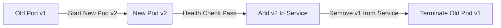

# 🚀 Kubernetes Deployment Strategies: Rolling Update & Rollback

## 📌 What is a Rolling Update?

Rolling update is a deployment strategy used to update Pods in a Deployment without downtime. It replaces old versions of Pods with new ones gradually.

### 🔬 Anatomy of Rolling Update

```yaml
apiVersion: apps/v1
kind: Deployment
metadata:
  name: ecommerce-frontend
spec:
  replicas: 4
  strategy:
    type: RollingUpdate
    rollingUpdate:
      maxUnavailable: 1  # Max number of pods that can be unavailable during update
      maxSurge: 1        # Max number of pods created above desired replicas
  selector:
    matchLabels:
      app: frontend
  template:
    metadata:
      labels:
        app: frontend
    spec:
      containers:
      - name: frontend
        image: ecommerce/frontend:v2  # new version
        ports:
        - containerPort: 80
```

### 💡 DevOps Principles Behind Rolling Updates

* **Zero Downtime**: New Pods are started before old ones are terminated.
* **Observability**: Rolling updates allow monitoring of new version behavior.
* **Rollback Friendly**: Can easily revert to previous version.

---

## 📌 What is a Rollback?

Rollback reverts the Deployment to a previous version if the current one fails.

### 🔁 How to Rollback

```bash
kubectl rollout undo deployment ecommerce-frontend
```

This brings back the previous ReplicaSet and terminates the failed one.

---

## 🧠 Real-World Example: E-Commerce App

**Use Case:**
You are running an e-commerce app. Frontend is deployed using a Deployment. You release a new UI feature.

* With rolling update, version `v1` Pods will be replaced gradually with `v2`.
* If `v2` has issues, rollback to `v1` without downtime.

---

## 📋 Tips and Best Practices

* ✅ Use `readinessProbe` to ensure only healthy pods are included in the service.
* 🛑 Don’t set `maxUnavailable` to 100%, it will cause downtime.
* 🔍 Monitor the update using:

```bash
kubectl rollout status deployment ecommerce-frontend
```

---

## ❓ Common Doubts & Questions

### Q1: What happens if the new version has a bug?

A: Kubernetes doesn’t rollback automatically, but you can do:

```bash
kubectl rollout undo deployment <name>
```

### Q2: How to check rollout history?

```bash
kubectl rollout history deployment ecommerce-frontend
```

### Q3: Is rolling update only for Deployments?

A: Yes, it is supported by Deployments. For StatefulSets, updates are done one pod at a time in order.

---

## 📊 Flow Diagram

**E-commerce Rolling Update Flow:**



---

✅ This topic is now complete. Let’s move to the next one when you're ready.
